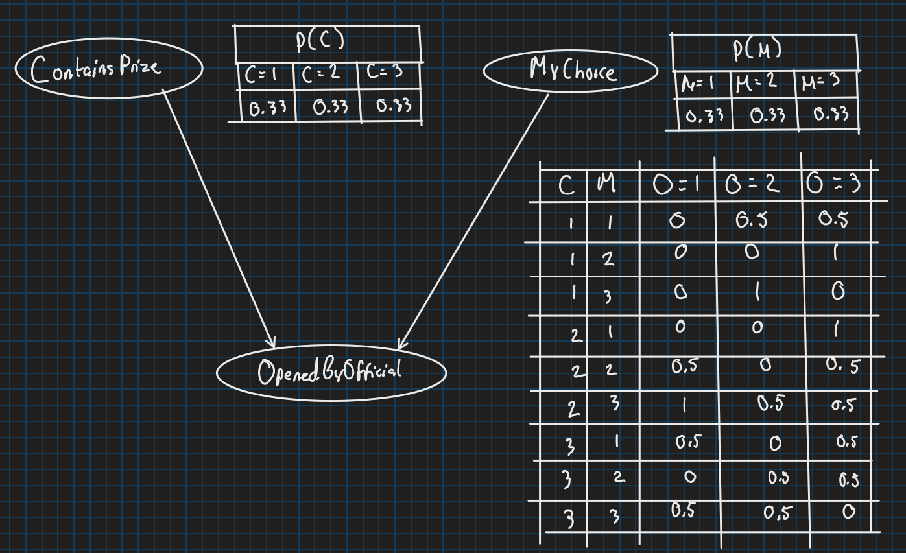

# The Monty Hall Problem

## Bayesian network

*Bayesian network of Monty Hall Problem with conditonal dependencies and probability tables*

## Numerical evidence:
We calculate the probability in the case where $MyChoice = U$ and $OpenedByOfficial = V$. 

We find the probability of $ContainsPrize = U$ (staying) versus $ContainsPrize = W$ (switching).

**We use Bayes' Theorem:**
$$
P(C \mid O, M) = \frac{P(O \mid C, M) \cdot P(C \mid M)}{P(O \mid M)}
$$

We find the denominator by summing all cases of $C$: 
$$
P(O=V \mid M=U) 
$$
$$
= 0.5 \times \frac{1}{3} + 0 \times \frac{1}{3} + 1 \times \frac{1}{3} = \frac{1}{2}
$$

**Staying**:
$$
P(C=U \mid O=V, M=U) 
$$
$$
= \frac {P(O=V \mid C=U, M=U) \cdot P(C=U \mid M=U)} {P(O=V \mid M=U)}
$$
$$
= \frac {\frac{1}{2} \times \frac{1}{3}}  {\frac{1}{2}} = \frac{1}{3}
$$

**Switching**:
$$
P(C=W \mid O=V, M=U) 
$$
$$
= \frac {P(O=V \mid C=W, M=U) \cdot P(C=W \mid M=U)} {P(O=V \mid M=U)}
$$
$$
= \frac {1 \times \frac{1}{3}}  {\frac{1}{2}} = \frac{2}{3}
$$

**Conclusion:**

The probability of winning if you switch to door $W$ is $2/3$ whereas if you stay on door $U$ the probability is $1/3$. 

Thus if you would like to win, you should switch!!