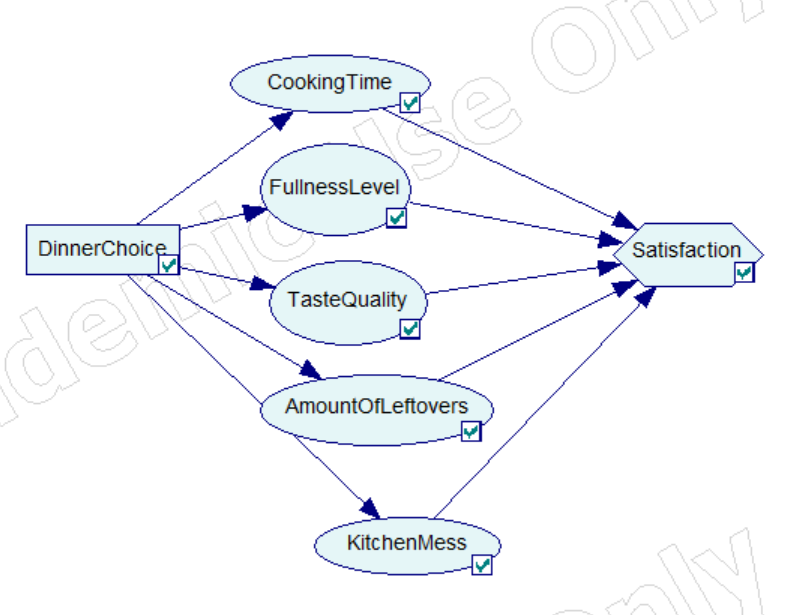
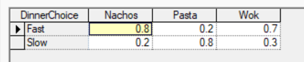
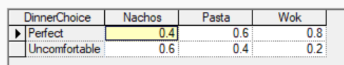
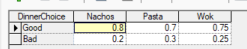
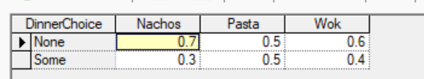
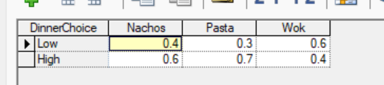
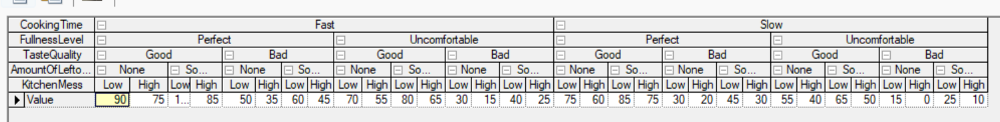
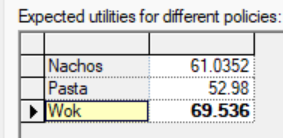

# Assignment 5

## Decision network

This model addresses the decision of selecting a dinner menu from three options: nachos, pasta, or wok. The problem balances trade-offs between cooking time, fullness, taste, leftovers and mess. 

<figure>
  
  <figcaption><i>Decision network</i></figcaption>
</figure>

## Probability distributions

<figure>
  
  <figcaption><i>CookingTime</i></figcaption>
</figure>

<figure>
  
  <figcaption><i>FullnessLevel</i></figcaption>
</figure>

<figure>
  
  <figcaption><i>TasteQuality</i></figcaption>
</figure>

<figure>
  
  <figcaption><i>AmountOfLeftovers</i></figcaption>
</figure>

<figure>
  
  <figcaption><i>KitchenMess</i></figcaption>
</figure>

<figure>
  
  <figcaption><i>Satisfaction</i></figcaption>
</figure>

## Assumptions

The model assumes that the uncertain variables, CookingTime, TasteQuality, KitchenMess, AmountOfLeftovers, and FullnessLevel, are conditionally independent given the MealChoice. While in reality a rushed meal might taste worse, this simplification makes the model more manageable. Furthermore, each uncertain variable is restricted to two states to maintain a managable utility table.  

## Optimal choice

<figure>
  
  <figcaption><i>Expected utilities</i></figcaption>
</figure>

The decision support system evaluated the three meal options based on the principle of maximum expected utility. After running the model, the software calculates an expected utility value for Nachos≈61, Pasta≈53, and Wok≈70. 

Thus, the results indicate that **Wok** is the optimal choice. 