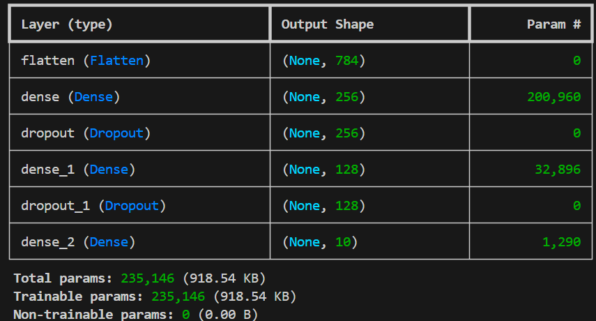
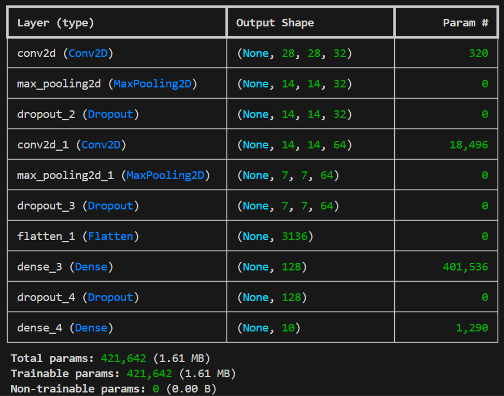
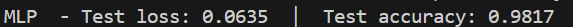
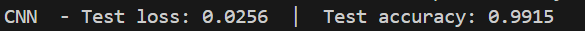

# Assignment 6

## Architectures

 MLP architecture

 

 CNN architecture

## Best Test Accuracy

 MLP results

 

 CNN results

| Model | Architecture | Epochs | LR | Test Accuracy |
|-------|-------------|--------|----|---------------|
| MLP | Dense(256) -> Dropout(0.3) -> Dense(128) -> Dropout(0.3) -> Dense(10) | 10 | 0.001 | 98.17% |
| CNN | Conv2D(32) -> Pool -> Dropout(0.25) -> Conv2D(64) -> Pool -> Dropout(0.25) -> Dense(128) -> Dropout(0.5) -> Dense(10) | 10 | 0.001 | 99.15% |

Both models use Adam and categorical cross-entropy loss.

## Model Comparison

The CNN (99.15%) outperforms the MLP (98.17%) despite having more total parameters. Both models use the Adam optimiser and dropout regularisation to reduce overfitting. The difference comes from the convolutional layers' weight sharing: each filter learns a local spatial pattern (edges, curves) that is applied across the entire image, making it translation-invariant and data-efficient. The MLP flattens the image first, discarding spatial structure, so it must learn each pattern independently for every pixel position. The CNN's architectural bias toward local features is well matched to the structure of handwritten digit images.

## Categorical Cross-Entropy on Softmax Output

Softmax converts the 10 output logits into a probability distribution:

$$p_k = \frac{e^{z_k}}{\sum_{j=1}^{10} e^{z_j}}$$

Categorical cross-entropy then penalises the predicted probability assigned to the correct class:

$$L = -\log p_{\text{true}}$$

Minimising this loss pushes the network to assign high probability to the correct digit class. Combined with backpropagation, this trains the model to discriminate between all 10 classes.
